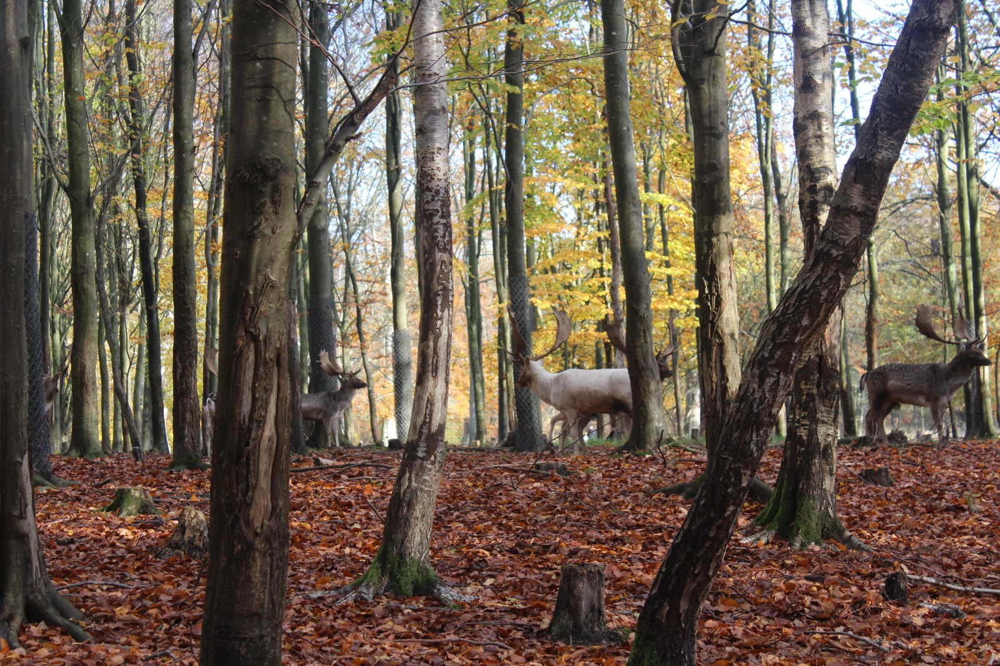
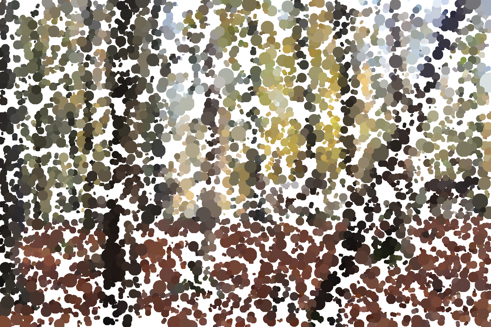

# Dot me, turning images into random points

This Python script takes an image, samples points at random and uses them as circles of varying radii. Each circle is then filled with the average color present inside it in the original image.

## Requirements

This project uses `numpy`, `pillow` and `click`. Install them by running

```
pip install -r requirements.txt
```

## Usage

```
python dot_me.py path/to/your/image.jpg --n_dots=5000 --out="name_of_result.jpg"
```

where the `n_dots` flag represents the number of circles (1500 by default), and the `out` flag is a string with the filename of the result (`./out.jpg` by default). Images are **not** required to be in `jpg` format.

## Example

Using the `autumn_deers.jpeg` image included in the repo, you could run



```
python dot_me.py autumn_deers.jpeg --n-dots=5000
```

resulting in 



